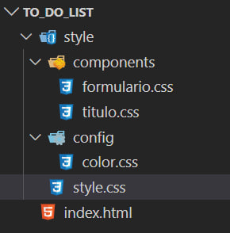

    
 

# **TO-DO LIST**

Este é um projeto de complexidade simples utilizando HTML, CSS e Javascript, de uma lista de tarefas.

----------------------
## **Resumo**
Este projeto surgiu da necessidade de compreender os fundamentos do objeto ``localStorage`` no Javascript e como seu funcionamento impacta na perfomance do navegador, uso de dados etc.  
Ele consiste em ser uma lista de tarefas, que deve me ajudar ao longo do dia-a-dia na escola onde trabalho. A lógica do projeto é:
- Criar uma página simples, com layout para celulares que contenha um input dentro de uma tag ``form`` do html;
- o input é submetido por um botão que contém a função de imprimir na tela um objeto html que consiste em um `input type="checked"` e uma linha `p` com o valor ``string`` passado no formulário;
- toda vez que o input checked for acionado, o texto é tachado, e passa para o fim da lista, a ideia é usar o JS para manipular o D.O.M nesse processo;
- Armazenar a lista com o objeto `localStorage` no navegador, para que a lista não se perca quando a página recarregar ou o aplicativo do Chrome mobile fechar;
- Um botão reset ao final da lista que remove todos os itens da lista.
- Para o futuro, implementar seções de atividades.

----------------------
## **Detalhes**
os arquivos CSS foram organizados com a intenção de corrigir algo que vinha dos meus primeiros projetos que era: inserir no arquivo ``index.html`` uma série de links de folha de estilo que poluiam o ``<head>``. Nesse caso busquei criar na pasta style dois diretórios (Componets e Config) que tem seus arquivos css importados para o arquivo principal ``style.css`` dessa maneira reduzo para uma única linha no ``<head>`` toda conexão existente com o css.

----------------------

## **Prévia**